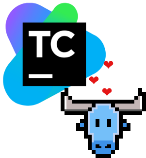

<p align="center">
    
</p>

---

# atoum/teamcity-extension [](https://travis-ci.org/Hywan/atoum-teamcity-extension)

[atoum](http://atoum.org/) is a PHP test
framework. [TeamCity](https://www.jetbrains.com/teamcity/) is a
software developed by Jetbrains for Continuous Integration (CI) and
Continuous Delivery (CD).

TeamCity uses
[a non-standard specific test execution report format](https://confluence.jetbrains.com/display/TCD8/Build+Script+Interaction+with+TeamCity). This
extension adds TeamCity support for atoum by supporting this
particular report format.

## Installation

With [Composer](https://getcomposer.org/), to include this extension into
your dependencies, you need to
require
[`atoum/teamcity-extension`](https://packagist.org/packages/atoum/teamcity-extension):

```sh
$ composer require atoum/teamcity-extension '~0.2'
```

To enable the extension, the `.atoum.php` configuration file must be edited to add:

```php
use atoum\teamcity;

$extension = new teamcity\extension($script);
$extension->addToRunner($runner);
```

## Testing

Before running the test suites, the development dependencies must be installed:

```sh
$ composer install
```

Then, to run all the test suites:

```sh
$ vendor/bin/atoum --test-ext
```

# License

Please, see the `LICENSE` file. This project uses the same license than atoum.
